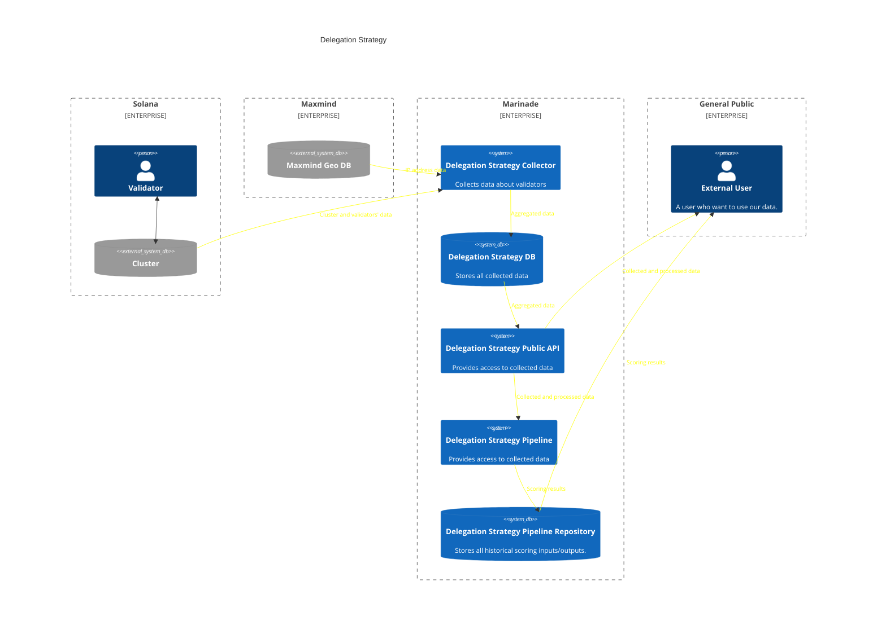

# Delegation Strategy

This repository contains all necessary components to track and collect validators' data and evaluate them for the purposes of Marinade's stake distribution.

## Repository structure
- [Rust API to expose all validators' data](./api)
- [Rust CLI tool to collect a snapshot from the Solana chain](./collect)
- [Rust CLI tool to store previously collected data to DB](./store)
- [DB migration scripts](./migrations)
- [A set of scoring and utility scripts](./scripts)

## Scoring
### Replicate official reports
Follow the steps described for each report on [the staking reports page](https://marinade.finance/validators/reports/)

### Create a new report
Prerequisities:
- [R installed](https://cran.r-project.org/)
- R packages installed (run from the cloned repository):
```bash
./scripts/scoring-install.bash
```

Inside the cloned repository run:
```bash
./scripts/scoring-fetch-inputs.bash                   # To fetch the latest data from API
./scripts/scoring-run.bash                            # To generate scores
./scripts/scoring-report.bash "- development version" # To generate report.html
```

## Development
### Prerequisities
- Rust - for development of data collection, storing and serving
- PostgreSQL - for the storage
- R - for the scoring calculations

### Env
Create a `.env` file after cloning the repository
```envc
POSTGRES_URL=postgresql://...
RPC_URL=https://api.mainnet-beta.solana.com
WHOIS_BEARER_TOKEN=...
ADMIN_AUTH_TOKEN=...
```

### Build
```bash
cargo build
```

## Automation
Automated pipelines that take care of running the scoring and storing the reports are located in the [Delegation Strategy - Pipeline](https://github.com/marinade-finance/delegation-strategy-pipeline) repository.

## Architecture

